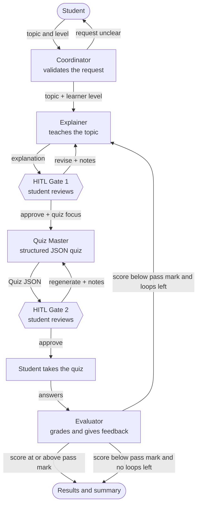
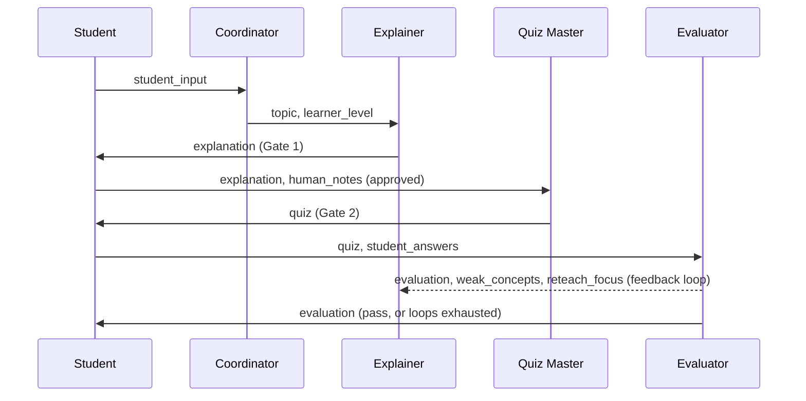

# 🦁 Leo — Multi-Agent AI Tutor

Leo is an interactive study assistant built from **four cooperating AI agents** (CrewAI) with a
**Streamlit** web UI. A student names a topic; Leo explains it, builds a quiz, grades the answers,
and — if the score is low — automatically re-teaches the weak concepts.

> **Bonus features (+10):**
> 1. **Human-in-the-Loop (HITL)** — the student reviews, revises or approves the explanation (Gate 1) and the quiz (Gate 2) before the flow continues.
> 2. **Automated Feedback Loop** — when the score is below the pass mark, the Evaluator routes the student back to the Explainer with the weak concepts and guidance, capped by a loop limit.

---

## Contents
1. [Features](#features)
2. [Architecture](#architecture)
3. [Agents and orchestration pattern](#agents-and-orchestration-pattern)
4. [Memory and context handoffs](#memory-and-context-handoffs)
5. [Bonus features in detail](#bonus-features-in-detail)
6. [Project structure](#project-structure)
7. [Setup](#setup)
8. [Run](#run)
9. [Configuration](#configuration)
10. [Testing](#testing)
11. [Troubleshooting](#troubleshooting)
12. [Requirement checklist](#requirement-checklist)

---

## Features

- Four distinct agents: **Coordinator, Explainer, Quiz Master, Evaluator**.
- **Structured output:** the Quiz Master returns JSON validated by Pydantic (`Quiz`), the Evaluator returns a validated `EvaluationResult`.
- **Live agent tracker** in the UI showing which agent is working, which are done and where the app is waiting for you.
- **Live agent log** and **handoff timeline** in the sidebar.
- **Interactive quiz** (radio buttons for multiple-choice and true/false, text box for short answers).
- **Deterministic grading** of objective questions in code; scores reported by the LLM are recomputed from per-question results.
- **Session state:** lesson, quiz, attempts, every explanation version and the handoff log survive Streamlit re-runs; the final report can be downloaded as JSON.
- No credentials in code: everything comes from environment variables (`.env`).

## Architecture



Handoff payloads (what each step passes on through the shared `TutorState`):



## Agents and orchestration pattern

| Agent | Role | Output | Tools |
|---|---|---|---|
| **Coordinator** | Front desk. Extracts the topic and learner level, asks a clarifying question if the request is vague. | JSON (`topic`, `learner_level`, `clear`, `notes`) or one clarifying question | `check_topic_clarity` |
| **Explainer** | Teaches with a fixed template: big idea, key concepts, worked example, analogy, common mistakes, recap. On re-teach it uses a different template aimed at the weak concepts. | Markdown explanation | optional web search (only if `SERPER_API_KEY` is set) |
| **Quiz Master** | Writes a mixed quiz (multiple choice, true/false, short answer), each question tagged with a concept so weak areas can be re-taught. | `Quiz` (Pydantic JSON) | none (the JSON format is embedded in the prompt) |
| **Evaluator** | Grades answers, writes feedback, finds weak concepts, recommends `proceed` or `reteach`. | `EvaluationResult` (Pydantic JSON) | `grade_objective_answers` |

**Orchestration pattern:** a custom, state-managed *sequential pipeline with a feedback loop and two human gates*, implemented in `src/workflow.py` (`LeoTutorWorkflow`). Each step runs one agent in its own single-task CrewAI `Crew`, and control returns to the caller at every gate. This is a deliberate choice over CrewAI's built-in sequential/hierarchical processes because the loop and the human pauses need explicit control:

- The workflow is a small state machine (`Phase`: intake → explanation review → quiz review → awaiting answers → complete).
- Routing is enforced **in code**: the Evaluator's `recommendation` is advisory; `LEO_PASS_THRESHOLD` and `LEO_MAX_RETEACH_LOOPS` decide.
- Structured outputs get one retry with a corrective hint if the JSON does not validate.
- A failed step never corrupts state: the phase stays where it was, and the UI offers a retry.

## Memory and context handoffs

All context is passed **explicitly** through one Pydantic object, `TutorState` (`src/models.py`):

`topic`, `learner_level`, `explanation`, `human_notes`, `quiz`, `student_answers`, `evaluation`, `reteach_count`, and a `handoffs` list.

Every transfer between agents (and between agents and the student) is recorded with `state.log_handoff(from, to, reason, *payload_keys)`; the UI renders these as the handoff timeline. Each agent's prompt is built from the state, so no agent depends on hidden conversation history. CrewAI agent memory can be toggled with `LEO_AGENT_MEMORY`, but it supplements rather than replaces the explicit state.

## Bonus features in detail

### 1. Human-in-the-Loop (HITL)
- **Gate 1 — after the explanation:** *Revise explanation* (free-text feedback sent to the Explainer, who rewrites it) or *Approve & build quiz* (optional "focus the quiz on…" notes are passed to the Quiz Master). Unlimited revisions.
- **Gate 2 — after the quiz is generated:** preview the questions (answers hidden), then *Generate a different quiz* (with guidance) or *Approve*.
- The workflow does not advance until the student acts; both gates are real phases (`EXPLANATION_REVIEW`, `QUIZ_REVIEW`), not cosmetic buttons.

### 2. Automated Feedback Loop
1. The student submits answers; the Evaluator grades them and the workflow recomputes the score from per-question results.
2. If `score < LEO_PASS_THRESHOLD` **and** `reteach_count < LEO_MAX_RETEACH_LOOPS`, the workflow logs an `Evaluator → Explainer` handoff and re-runs the Explainer with `weak_concepts`, `reteach_focus` and the previous explanation, using a re-teach template (new analogy, new example, misconception section).
3. The new explanation goes through HITL Gate 1 again, then a fresh quiz is generated.
4. When the loop limit is reached the session finishes with feedback instead of looping forever (`loop_exhausted`).
5. The UI shows a *Feedback loop* banner, the previous attempt's feedback, and a score-by-attempt chart.

## Project structure

```
leo-tutor/
├── app.py                 # Streamlit UI
├── requirements.txt
├── .env.example           # environment schema (no secrets)
├── .streamlit/config.toml
├── pytest.ini
├── README.md
├── src/
│   ├── config.py          # settings + LLM factory (reads env vars)
│   ├── models.py          # Quiz, EvaluationResult, TutorState, HandoffEvent
│   ├── tools.py           # agent tools
│   ├── agents.py          # the four agents + prompt templates
│   ├── tasks.py           # task builders + JSON parsing helpers
│   └── workflow.py        # LeoTutorWorkflow state machine (+ console runner)
└── tests/                 # pytest suite (models, tools, tasks, workflow, UI)
```

## Setup

Requires Python 3.10–3.13.

```bash
# 1. Create and activate a virtual environment
python -m venv venv
venv\Scripts\activate          # Windows PowerShell
# source venv/bin/activate     # macOS / Linux

# 2. Install dependencies
pip install -r requirements.txt

# 3. Configure your LLM
copy .env.example .env         # Windows   (macOS/Linux: cp .env.example .env)
```

Edit `.env` and set `LEO_MODEL` plus the matching key. Example for Groq:

```
LEO_MODEL=groq/openai/gpt-oss-120b
GROQ_API_KEY=your-key-here
```

Model availability changes over time (Groq has retired models before). If you get a "model not found" error, list the models your key can use in your provider's console and update `LEO_MODEL`.

## Run

**Web UI (recommended):**
```bash
streamlit run app.py
```
Open the URL shown in the terminal (usually http://localhost:8501). The first time Streamlit may ask for an email; press Enter to skip.

**Console version (no UI):**
```bash
python -m src.workflow
```

## Configuration

| Variable | Default | Meaning |
|---|---|---|
| `LEO_MODEL` | `openai/gpt-4o-mini` | `provider/model` string (`openai`, `anthropic`, `gemini`, `groq`, …) |
| `LEO_TEMPERATURE` | `0.3` | Base temperature (each agent adjusts it slightly) |
| `OPENAI_API_KEY` / `ANTHROPIC_API_KEY` / `GEMINI_API_KEY` / `GROQ_API_KEY` | – | Key for the provider you chose |
| `SERPER_API_KEY` | – | Optional: enables web search for the Explainer |
| `LEO_PASS_THRESHOLD` | `70` | Score (%) below which the feedback loop triggers |
| `LEO_MAX_RETEACH_LOOPS` | `2` | Maximum re-teach rounds |
| `LEO_AGENT_MEMORY` | `true` | CrewAI agent memory (set `false` if you see embedding/OpenAI key errors with a non-OpenAI provider) |
| `LEO_VERBOSE` | `true` | Verbose CrewAI logs in the terminal |

## Testing

```bash
python -m pytest -v
```

The suite uses a fake runner, so no API key or network is needed. It covers the Pydantic models, tools, JSON parsing, the full workflow (HITL gates, feedback loop, loop cap, error cases) and the Streamlit UI flow (via Streamlit's `AppTest`).

## Troubleshooting

| Symptom | Fix |
|---|---|
| `No module named 'src.tasks'` | `tasks.py` / `workflow.py` are missing from `src/` |
| `LiteLLM fallback package is not installed` | `pip install litellm` |
| `model ... does not exist or you do not have access` | Choose a model your key can use and update `LEO_MODEL` |
| `invalid JSON schema for tool` | A tool with no arguments was added; give every tool at least one argument |
| "Share execution trace?" prompt in the terminal | Tracing prompts are disabled by `app.py`; for the console runner set `CREWAI_TRACING_ENABLED=false` |
| Rate-limit (429) errors | Wait a minute and use the **Retry** button in the UI |

## Requirement checklist

| Requirement | Where |
|---|---|
| CrewAI framework with custom state/tasks | `src/agents.py`, `src/tasks.py`, `src/workflow.py` |
| Streamlit UI with live agent execution and handoffs | `app.py` (agent tracker, live log, handoff timeline) |
| Coordinator, Explainer, Quiz Master, Evaluator | `src/agents.py` |
| Structured output (Pydantic/JSON) | `Quiz`, `EvaluationResult` in `src/models.py` |
| Interactive quiz and feedback | `render_quiz_form`, `render_complete` in `app.py` |
| **Bonus:** Feedback loop | `submit_answers` / `_start_reteach` in `src/workflow.py`; banner in `render_gate1` |
| **Bonus:** Human-in-the-loop | Gate 1 / Gate 2 phases in `src/workflow.py`; forms in `render_gate1` / `render_gate2` |
| Explicit memory and context handoffs | `TutorState`, `log_handoff` in `src/models.py` |
| No hardcoded credentials | `src/config.py`, `.env.example`, `.gitignore` |
