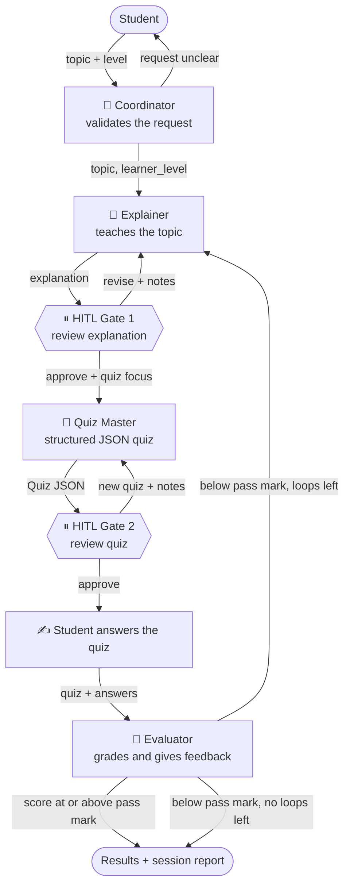
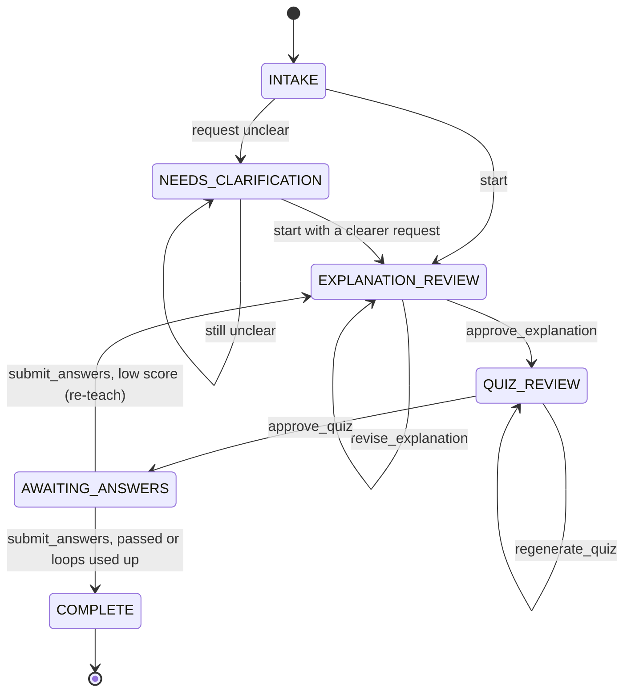
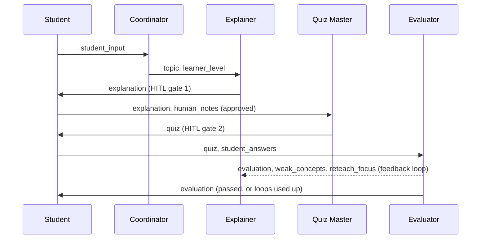

<div align="center">

# 🦁 Leo — Multi-Agent AI Tutor

**Four cooperating AI agents that teach you a topic, quiz you, grade your answers, and re-teach what you missed.**


[**▶ Live demo**](https://leomulti-agentaitutor-89.streamlit.app/) · [Architecture](#-architecture) · [Quick start](#-quick-start) · [Bonus features](#-bonus-features)

</div>

---

## 📖 Overview

Leo is an interactive study assistant built for **Assignment 26**. You type what you want to learn; Leo hands your request through a team of four specialised agents, and you stay in control at every step.

1. **Ask** — the *Coordinator* checks your request (and asks a follow-up question if it is vague).
2. **Learn** — the *Explainer* writes a structured lesson. You review it and can ask for changes.
3. **Practice** — the *Quiz Master* creates a quiz as validated JSON. You preview it before taking it.
4. **Get feedback** — the *Evaluator* grades your answers. If your score is below the pass mark, Leo **automatically re-teaches** the weak concepts and gives you a fresh quiz.

## ✨ Features

| | |
|---|---|
| 🤖 **4 distinct agents** | Coordinator, Explainer, Quiz Master, Evaluator, each with its own role, backstory, prompt template, temperature and tools |
| 🧑‍🏫 **Human-in-the-Loop** | Two real review gates (after the explanation and after the quiz) with Approve / Revise buttons and free-text feedback |
| 🔁 **Automated feedback loop** | Low score → Evaluator routes back to the Explainer with the weak concepts → new lesson → new quiz, capped by a loop limit |
| 🧾 **Structured output** | Quiz and evaluation are Pydantic models, validated with one automatic retry on malformed JSON |
| 🎯 **Trustworthy grading** | Multiple-choice and true/false are graded in code; the LLM's overall score is recomputed from per-question results |
| 📡 **Live visibility** | Agent tracker (who is working now), live event log and a handoff timeline in the sidebar |
| 🧠 **Explicit context handoffs** | One `TutorState` object carries topic → explanation → quiz → answers → evaluation between agents |
| 📚 **Session history** | Every explanation version and quiz attempt is kept; download the full session as a JSON report |
| 🔐 **No hardcoded secrets** | Keys come from environment variables (`.env` locally, Secrets on Streamlit Cloud) |
| ✅ **Tested without an API key** | 26 pytest tests, including the Streamlit UI flow, run against a fake LLM |

<!--
## 🖼 Screenshots
Add your screenshots to docs/screenshots/ and uncomment this block.

| Agent tracker | HITL gate 1 |
|---|---|
|  |  |

| Quiz | Feedback loop |
|---|---|
|  |  |
-->

## 🏗 Architecture

### End-to-end flow



### Workflow state machine

`LeoTutorWorkflow` is a small state machine. Each method runs the agents for one step and returns control to the UI at every human gate. Calling a method in the wrong phase raises `InvalidTransitionError`.



### Context handoffs



## 🤖 The agents

| Agent | Job | Output | Tools | Temp. |
|---|---|---|---|---|
| 🧭 **Coordinator** | Front desk: extracts the topic and learner level, asks one clarifying question when the request is vague or off-topic | JSON (`topic`, `learner_level`, `clear`, `notes`) or a plain-text question | `check_topic_clarity` | 0.2 |
| 📘 **Explainer** | Teaches with a fixed template: big idea, key concepts, worked example, analogy, common mistakes, recap. On re-teach it switches to a template that targets only the weak concepts with a new analogy and example | Markdown lesson | web search (`SerperDevTool`) only if `SERPER_API_KEY` is set | 0.5 |
| 📝 **Quiz Master** | Writes a mixed quiz (multiple choice, true/false, short answer). Every question carries a `concept_tag` so weak areas can be re-taught | `Quiz` (Pydantic) | none: the JSON format is embedded in the prompt | 0.4 |
| 🎯 **Evaluator** | Grades answers, writes constructive feedback, finds weak concepts and recommends `proceed` or `reteach` | `EvaluationResult` (Pydantic) | `grade_objective_answers` | 0.1 |

Only the Coordinator is allowed to delegate; the specialists stay focused on one job. Prompt templates live in [`src/agents.py`](src/agents.py).

### Orchestration pattern

Leo uses a **custom, state-managed sequential pipeline with two human gates and a feedback loop**, implemented in [`src/workflow.py`](src/workflow.py). Each step runs one agent as a single-task CrewAI `Crew`. This was chosen over CrewAI's built-in sequential or hierarchical processes because the loop and the human pauses need explicit control:

- **Routing is enforced in code.** The Evaluator's `recommendation` is advisory; `LEO_PASS_THRESHOLD` and `LEO_MAX_RETEACH_LOOPS` decide.
- **Every task retries once** with a corrective hint, and a JSON reply that a provider rejects as a bad tool call (a known Groq `tool_use_failed` quirk) is recovered from the error instead of failing.
- **A failed step never corrupts state.** The phase stays where it was, `WorkflowError` is raised, and the UI offers a **Retry** button.
- **Scores are verified.** The overall score is recomputed from per-question results, and a corrected score is logged when the LLM's figure is off.

### Shared state

All context moves through one Pydantic object, `TutorState` ([`src/models.py`](src/models.py)):

| Field | Meaning |
|---|---|
| `topic`, `learner_level` | Set by the Coordinator |
| `explanation`, `explanation_approved` | Written by the Explainer, approved at gate 1 |
| `human_notes` | The student's feedback at a gate |
| `quiz`, `quiz_approved` | Written by the Quiz Master, approved at gate 2 |
| `student_answers` | Submitted by the student |
| `evaluation` | Written by the Evaluator (score, per-question feedback, weak concepts, recommendation) |
| `reteach_count` | How many feedback-loop rounds have been used |
| `handoffs` | Every transfer, recorded with `log_handoff(from, to, reason, *payload_keys)` and shown in the sidebar |

Each agent's prompt is built from this state, so nothing depends on hidden chat history.

## 🏆 Bonus features

### 1. Human-in-the-Loop (HITL)

| Gate | When | What the student can do |
|---|---|---|
| **Gate 1** | After the explanation | **Revise** with free-text feedback (unlimited times) or **Approve**, optionally adding "focus the quiz on…" notes |
| **Gate 2** | After the quiz is generated | Preview the questions (answers hidden), then **Generate a different quiz** with guidance or **Approve** |

Both gates are real workflow phases (`EXPLANATION_REVIEW`, `QUIZ_REVIEW`). The pipeline cannot advance until the student acts.

### 2. Automated feedback loop

1. The student submits answers; the Evaluator grades them and the score is verified in code.
2. If `score < LEO_PASS_THRESHOLD` **and** `reteach_count < LEO_MAX_RETEACH_LOOPS`, an `Evaluator → Explainer` handoff is logged and the Explainer re-teaches using `weak_concepts`, `reteach_focus` and the previous lesson.
3. The new lesson goes through gate 1 again, then a fresh quiz is generated.
4. When the loop limit is reached, the session ends with feedback instead of looping forever (`loop_exhausted`).
5. The UI shows a **Feedback loop** banner, the previous attempt's feedback and a score-by-attempt chart.

## 🧰 Tech stack

| Layer | Technology |
|---|---|
| Agents / orchestration | [CrewAI](https://github.com/crewAIInc/crewAI) with a custom workflow state machine |
| LLM access | CrewAI `LLM`; Groq is routed through its OpenAI-compatible endpoint, other providers via LiteLLM |
| Data models | Pydantic v2 |
| UI | Streamlit (session state, forms, live placeholders) |
| Config | `python-dotenv` + environment variables |
| Tests | pytest + Streamlit `AppTest` |

## 📁 Project structure

```
Leo_Multi-Agent_AI_Tutor/
├── app.py                    # Streamlit UI
├── requirements.txt
├── .env.example              # environment schema (no secrets)
├── .gitignore
├── .streamlit/
│   └── config.toml
├── .devcontainer/
│   └── devcontainer.json     # GitHub Codespaces setup (Python 3.11)
├── src/
│   ├── config.py             # settings + LLM factory
│   ├── models.py             # Quiz, EvaluationResult, TutorState, HandoffEvent
│   ├── tools.py              # agent tools
│   ├── agents.py             # the four agents + prompt templates
│   ├── tasks.py              # task builders + JSON parsing helpers
│   └── workflow.py           # LeoTutorWorkflow state machine (+ console runner)
└── test/                     # pytest suite
    ├── conftest.py
    ├── test_models.py
    ├── test_tools.py
    ├── test_tasks.py
    ├── test_agents.py
    ├── test_workflow.py
    └── test_app.py
```

## 🚀 Quick start

**Requirements:** Python 3.10–3.13 and an API key for one LLM provider.

> Python 3.14 is not supported yet: CrewAI's ChromaDB dependency uses `pydantic.v1`, which fails to import there.

```bash
# 1. Clone
git clone https://github.com/mdshafathossain-tech/Leo_Multi-Agent_AI_Tutor.git
cd Leo_Multi-Agent_AI_Tutor

# 2. Create and activate a virtual environment
python -m venv venv
venv\Scripts\activate            # Windows
# source venv/bin/activate       # macOS / Linux

# 3. Install dependencies
pip install -r requirements.txt

# 4. Configure your model and key
copy .env.example .env           # Windows
# cp .env.example .env           # macOS / Linux
```

Edit `.env`. Example for Groq:

```env
LEO_MODEL=groq/openai/gpt-oss-120b
GROQ_API_KEY=your-key-here
LEO_AGENT_MEMORY=false
```

Then run:

```bash
streamlit run app.py             # web UI at http://localhost:8501
python -m src.workflow           # optional: console version, no UI
```

> Model names change over time (Groq has retired models before). If you see a "model not found" error, check your provider's console for the models your key can use and update `LEO_MODEL`.

## ⚙️ Configuration

| Variable | Default | Meaning |
|---|---|---|
| `LEO_MODEL` | `openai/gpt-4o-mini` | `provider/model` string (`openai`, `anthropic`, `gemini`, `groq`, …) |
| `LEO_TEMPERATURE` | `0.3` | Base temperature (each agent overrides it with its own) |
| `OPENAI_API_KEY`, `ANTHROPIC_API_KEY`, `GEMINI_API_KEY`, `GROQ_API_KEY` | – | Key for the provider you chose |
| `GROQ_BASE_URL` | `https://api.groq.com/openai/v1` | Optional Groq endpoint override |
| `SERPER_API_KEY` | – | Optional: gives the Explainer a web-search tool |
| `LEO_PASS_THRESHOLD` | `70` | Score (%) below which the feedback loop triggers |
| `LEO_MAX_RETEACH_LOOPS` | `2` | Maximum re-teach rounds |
| `LEO_AGENT_MEMORY` | `true` | CrewAI agent memory flag. Use `false` if you see embedding or OpenAI-key errors with a non-OpenAI provider |
| `LEO_VERBOSE` | `true` | Verbose CrewAI logs in the terminal |
| `CREWAI_TRACING_ENABLED` | `false` | Avoids the "share execution trace?" prompt in the console |

## ☁️ Deploy on Streamlit Community Cloud

1. Push the repository to GitHub (make sure `.env` is **not** committed).
2. On [share.streamlit.io](https://share.streamlit.io) choose **Create app**, select the repository and `app.py`.
3. Open **Advanced settings** and set **Python version to 3.12** (the default may be 3.14, which fails with a `pydantic.v1` error).
4. Paste your settings into the **Secrets** box (TOML, values in quotes):

```toml
GROQ_API_KEY = "your-key-here"
LEO_MODEL = "groq/openai/gpt-oss-120b"
LEO_AGENT_MEMORY = "false"
LEO_VERBOSE = "false"
CREWAI_TRACING_ENABLED = "false"
```

Top-level secrets are exposed as environment variables, so the app needs no code change. A public app spends **your** API quota, so keep the app private or remove the key when you are done.

## 🧪 Testing

```bash
python -m pytest -v
```

The suite needs no API key or network. It replaces the LLM runner with a fake and covers:

- Pydantic model validation (e.g. duplicate question IDs, wrong option counts)
- Tools and JSON parsing (fenced JSON, prose around JSON, malformed output)
- The full workflow: both HITL gates, the feedback loop, the loop cap, blank answers, wrong-phase calls
- The Streamlit UI flow via `AppTest`

## 🛠 Troubleshooting

| Symptom | Fix |
|---|---|
| `ConfigError: unable to infer type for attribute` on Streamlit Cloud | The app runs on Python 3.14. Redeploy with Python 3.12 |
| `The model ... does not exist or you do not have access to it` | Pick a model your key can use and update `LEO_MODEL` |
| `LiteLLM fallback package is not installed` | `pip install litellm` |
| `tool_use_failed … attempted to call tool 'json'` (Groq) | Handled automatically: Leo recovers the reply and retries once. If it still fails, click **Retry** or try another model |
| `invalid JSON schema for tool …` | A tool without arguments was added. Give every tool at least one argument |
| `cache_breakpoint is unsupported` (Groq) | Use the `groq/` prefix so requests go through the OpenAI-compatible route in `src/config.py` |
| Rate-limit (429) errors | Wait a minute, then use **Retry** in the UI |
| "Share this execution trace?" in the terminal | Set `CREWAI_TRACING_ENABLED=false` |

## ✅ Requirement checklist

| Requirement | Where |
|---|---|
| CrewAI with custom state and tasks | `src/agents.py`, `src/tasks.py`, `src/workflow.py` |
| Streamlit UI with live agent execution and handoffs | `app.py` (agent tracker, live log, handoff timeline) |
| Coordinator, Explainer, Quiz Master, Evaluator | `src/agents.py` |
| Structured output (Pydantic / JSON) | `Quiz`, `EvaluationResult` in `src/models.py` |
| Interactive quiz and feedback | `render_quiz_form`, `render_complete` in `app.py` |
| **Bonus:** feedback loop | `submit_answers`, `_start_reteach` in `src/workflow.py`; banner in `render_gate1` |
| **Bonus:** human-in-the-loop | gate phases in `src/workflow.py`; forms in `render_gate1`, `render_gate2` |
| Explicit memory and context handoffs | `TutorState`, `log_handoff` in `src/models.py` |
| No hardcoded credentials | `src/config.py`, `.env.example`, `.gitignore` |

## ⚠️ Limitations

- **Session-only memory.** Sessions live in Streamlit session state; closing the tab ends them (use the JSON report to keep results).
- **Short answers are LLM-graded**, so they are less deterministic than multiple-choice and true/false.
- **Quality depends on the model** you configure; smaller models may need a retry on structured output.

## 👤 Author

Built by **Shafat** ([@mdshafathossain-tech](https://github.com/mdshafathossain-tech)) as Assignment 26: *Leo: Multi-Agent AI Tutor*.
